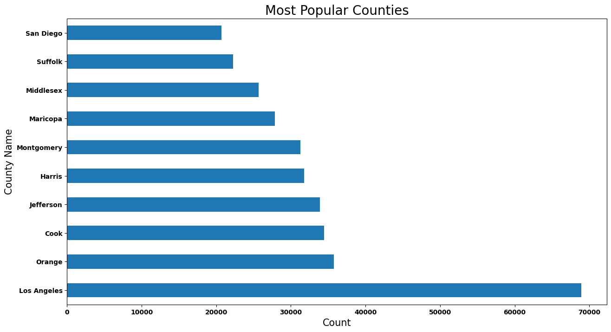
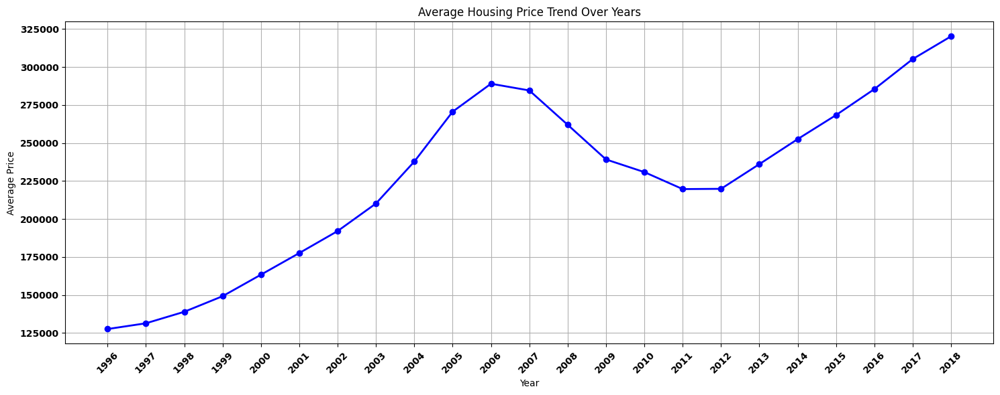
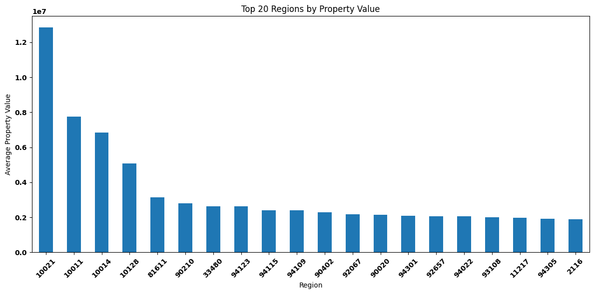
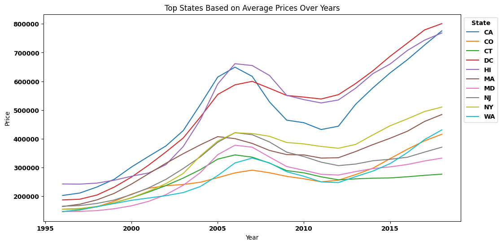
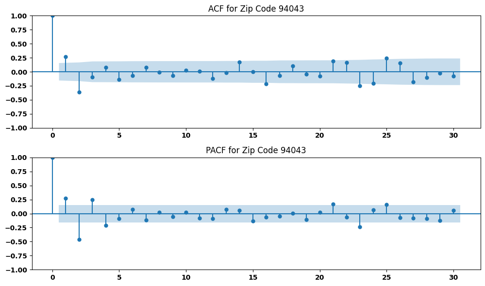
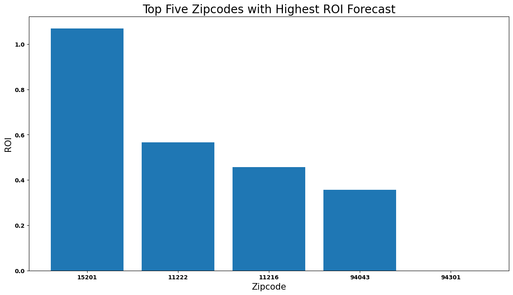

## FORECASTING REAL ESTATE PRICES USING TIME SERIES ANALYSIS

### Executive Summary

***
### Business Understanding
 #### [1.1 Background](##Background)
In a constantly evolving real estate landscape, various elements, including economic shifts, population dynamics, market emotions, and regulatory shifts, converge to shape market trends. Acknowledging this complexity, the Kar-Dak Investment Group acknowledges the strategic advantage of harnessing data science methodologies to proactively uncover lucrative investment prospects.
#### [1.2 Business Problem]( Business-Problem)
 Property investment offers multiple revenue streams including leasing income and asset growth, and provides benefits such as passive income and portfolio diversification, which makes it an attractive option for many investors. However, the critical issue at hand is identifying optimal locations for real estate investment. The primary objective of this project is to facilitate informed real estate investment decisions for the Kar-Dak Investment Group. By leveraging the extensive Zillow housing dataset, which spans from April 1996 to April 2018, the project aims to identify the top 5 most favorable zip codes for potential investment opportunities.
#### [1.3 Project Question](#Project-Question)
This Project aims at answering the question:
1. What are the top 5 best zip code areas for the Kar-Dak Investments to consider?
 #### [1.4 Objectives](#Objectives)
1. To identify the top 5 zip codes with the highest ROI.
2. To develop time series models to forecast real estate prices for different zip codes over various time horizons.
3. To establish cities that are optimal for both short-term and long-term investment
***
### Data Understanding
Our dataset was obtained from zillow research website which ontained real state data. The key columns in the dataset are as follows:

`RegionName` - This is the ranking done based on the size of the Region.

`SizeRank` This field contains the zip code of the Region.

`RegionType` Type of Region is Zip.

`StateName` State.

`City` This column provide the specific City Name of Housing Data.

`Metro` This provide the name of the metro city around that Region.

`County Name` This is the County Name for that Region.

`Months Column` These Columns contains the prices of Region for every month.

The dataset covers a significant time period (April 1996 to April 2018), allowing for the exploration of long-term trends and capturing various market conditions. It provides a valuable resource for conducting time series analysis and developing predictive models to forecast prices

***
### Exploratory Data Analysis
#### [Data Conversion](#Data-Conversion)
The data was converted from a wide format to a long format before analysis.
this stage of the analysis focused on such aspects as:

#### [distribution of zip codes per County](#distribution-of-zip-codes-per-County)

Based on the bar graph above, this shows that Los Angeles is the most popular county with around 70000 zipcodes.Most of the other counties range between 30000 and 50000 zipcodes.

#### [Average housing price pattern/trend over the years](Average-housing-price-pattern/trend-over-the-years)

The graph shows that the average housing price has been increasing steadily over the years, with a dip between 2007 and 2012. Since then, the average housing price has rebounded and continued to rise

#### [poperty value and distribution](poperty-value-and-distribution)

Zipcode 10021,10011, 10014, 10128 in New York has properties with the highest value, followed by 94027 in California and 81611 in Colorado, and the other remaining Zipcodes range between 2 to 3 Million.

#### percentage of return on investents for the top ten states

As observed, the percentage of return on investents for the top ten states had a crash in 2008 to 2012 and then from there they all have an upward linear trend. This also depicts the rising trent has been from 2012 onwards meaning 2018 remains highest in terms of investments returns.

***
### Data preprocessing
Prior to modeling, a thorough assessment of data stationarity will be conducted using the following methods:

1. Dickey-Fuller Test: The Dickey-Fuller test will be employed to assess the stationarity of the data. This statistical test helps determine if a unit root is present in the series, which is indicative of non-stationarity.

2. Rolling Mean Analysis: Additionally, a rolling mean analysis will be performed. This involves calculating the mean over a sliding window of observations. Fluctuations in the rolling mean indicate non-stationarity.

In cases where the data is identified as non-stationary, a differencing technique will be applied. Differencing involves computing the difference between consecutive observations. This process helps transform the data into a stationary form, enabling more accurate modeling and analysis.

***
### Modelling
The goal of modeling is to provide a conceptual and organized framework that helps in making predictions or decisions based on the data.
Since the aim is to identify the top five zipcodes to invest in, five different models for each of the top five zipcodes were developed to help investers forecast their prices and thus give the them clear path to make informed decision.

#### [Baseline Model - ARIMA](##Baseline-Model--ARIMA)
ARIMA is a popular time series forecasting model that combines autoregressive, differencing, and moving average components.

Its use for price prediction is justified due to its ability to capture time-dependent patterns, handle nonlinear relationships, address stationarity, provide interpretability, and its well-established framework in time series analysis.

below is a plot of Autocorrelation Function (ACF) and Partial Autocorrelation Function (PACF) of the dataset to determine the appropriate values of the ARIMA model parameters ("p" "d"and "q").

#### [Model Selection](##Model-Selection)
The best-fitting model is specified as ARIMA(2,0,3)(0,0,0)[0] intercept, indicating that it includes autoregressive (AR) terms, moving average (MA) terms, and an intercept.

The model was fitted using 158 observations from February 1, 2005, to April
1, 2018.

The p-values associated with the coefficients indicate whether they are statistically significant. Small p-values suggest significant effects.

#### [Model Fitting](##Model-Fitting)
An ARIMA model was fitted to multiple time series data corresponding to different zip codes.
***
#### [Model Evaluation](##Model-Evaluation)
The model's performance was evaluated using Mean Squared Error. it was noted to have an MSE of 0.0036754150523843564. This tells us that our monthly returns would be off by 0.0037% if this model is used Which is good thing since it is not off by much.

####  [Forecasting for for Top five Zipcodes)](##Forecasting-for-Top-five-Zipcodes)
Once the model was evaluated and deemed satisfactory, it was used to make future predictions as below.

As can be seen on the graph, zipcode 15201 has the highest return on investment followed by zipcodes 11222 and 11216. zipcode 94301 has the lowest return on investment.
### Conclusion
**Comparative Analysis of the Forecasting Models**
The analysis presented a comprehensive comparison of three forecasting models: Autoregressive Integrated Moving Average (SARIMA), and Baseline ARIMA. Each model was assessed based on their predictive performance, statistical significance of coefficients, and alignment with historical trends. Below is a summary of the findings:

**Sarima model:**

The SARIMA models displayed competitive predictive performance, with relatively low MSE values across the test dataset. Each SARIMA model's parameter configuration was chosen to strike a balance between fitting and model simplicity. Notably, some p-values exceeded the significance threshold, indicating potential limitations in capturing certain variations. Despite these limitations, the SARIMA models effectively aligned with historical trends and provided insightful forecasts.

 Based on the models the best five zipe codes were identified as ;
1. **11216**: NY: Kings
2. **11222**: NY: Kings
3. **94043**: CA: Santa Clara
4. **94301**: CA: Santa Clara
5. **15201**: PA: Allegheny

In conclusion, all two models showcased valuable forecasting capabilities with their unique strengths and limitations.
The Baseline ARIMA, Tuned ARIMA, and SARIMA models excelled in capturing temporal dependencies. Although the model's forecasting may have been affected by other limitations.

***
### Recommendations
* Based on the comprehensive analysis conducted using the provided dataset and
  considering the states of Pennsylvania, Carlifonia, and New york, below are some key recommendations:

* Consider Diversification: While all the analyzed states exhibit favorable
  investment opportunities, consider diversifying the investment portfolio  across multiple states. This approach can help mitigate risk and capture various market dynamics.

* Explore South Carolina: Given the higher volume of data originating from      South Carolina and the presence of two distinct cities (Greenville and
 Florence), exploring properties in this state could provide a stable investment environment.

* ROI as a Key Indicator: Return on Investment (ROI) is a critical metric for
 evaluating the potential profitability of investments. Focus on cities with higher ROI figures, as they indicate efficient investment opportunities. Kings, Santa Clara, and Allegheny stand out with robust ROI values.

* Risk Assessment: Take into consideration the Coefficient of Variation (CV) to assess investment risk. Lower CV values, like that of Greenville, indicate a more stable investment environment. Balancing ROI with risk is crucial for informed decision-making.

* Location Matters: Consider the city's unique characteristics, development
  prospects, and economic growth when making investment decisions. Evaluate factors like infrastructure, amenities, and potential for future demand.
  
In conclusion, Diversification, ROI analysis, risk assessment, and careful consideration of each city's unique attributes are crucial when making real estate investment decisions.

***
### Limitations
* Our model was delimited by overfitting wich may have caused our forecasting slightly deviate from the correct forecasting.

## **Next Steps**

* An external dataset with economic indicators can be integrated, to provide a
  holistic view of factors influencing housing prices.
* Augmenting the dataset with additional variables that might influence housing
  prices, such as interest rates, unemployment rates, or local economic indicators. This could improve the predictive accuracy of the choosen model.
  Housing market trends can change due to various unforeseen factors (e.g., economic downturns, pandemics, policy changes).
  
* To explore other tunimg techniques to improve on performance of the model.